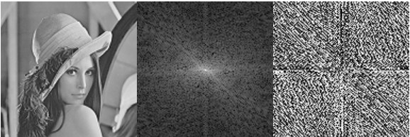

## Description
The class assignments of OpenCV 

## Requirements
- Install OpenCV 2.4.13
    * Windows: [install-opencv-visual-studio](https://marcomuraresearch.wordpress.com/2015/04/16/install-opencv-visual-studio/), [tutorial_windows_install](https://docs.opencv.org/master/d3/d52/tutorial_windows_install.html)
    * Linux: [tutorial_linux_install](https://docs.opencv.org/master/d7/d9f/tutorial_linux_install.html)
- IDE: Visual Studio

## Histogram Equalization
Simple implementation of Histogram Equalization

## Edge Detection
Draw the edge of the image

## Sketch Effect
Add sketch effect by using edge detection

## Discrete Fourier Transform
Display the transformed result

